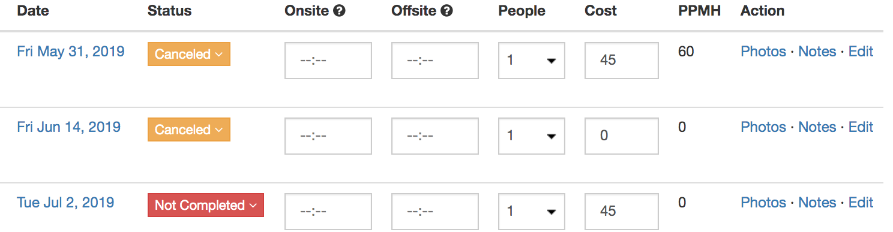
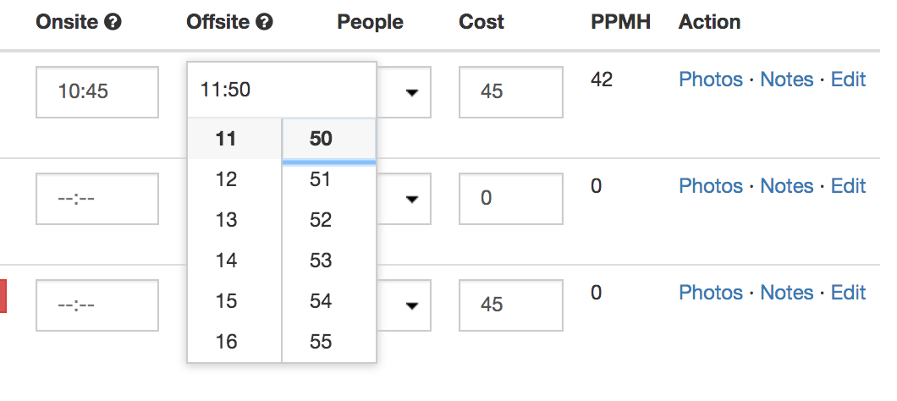
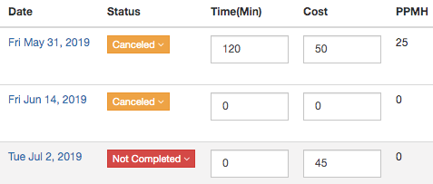

# Completing Work

In order to complete work follow one of the methods enabled by the administrator within the company.

- [Time On Site / Time From Site](#time-on-site--time-from-site)
- [Minutes On Site](#minutes-on-site)

## Time On Site / Time From Site

This method provides accountability and reflection on when the work was completed. It is an extension off [Minutes On Site](#minutes-on-site) method in the sense that minutes are calculated as *(Time From Site - Time On Site) x People On Site*. 

In order to complete time on site visit the jobs screen. There will three new rows in the table, *Onsite*, *Offsite* and *People*.

Click on time and use the selector to select time on site and off site.

Use the dropdown to select number of people on site. Minutes will be automatically calculated along with Profit Per Man Hour (PPMH). Profit per man hour is calculated as *Cost / (Minutes on Site / 60)*.

## Minutes On Site

This is a simpler method for completion where only minutes on site are required. In order to correctly calculate Profit Per Man Hour, the entrant should recall number of people on site and multiply that number by minutes on site. 

