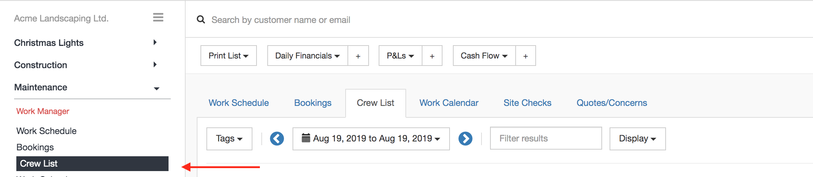
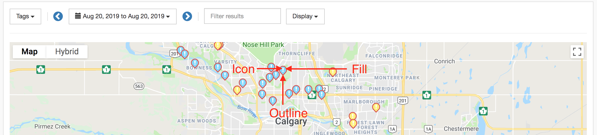
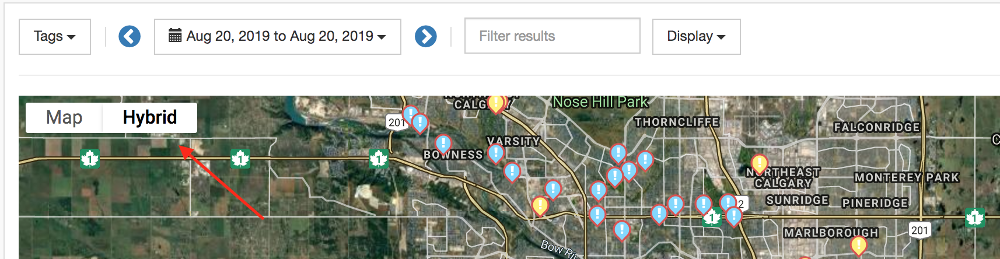
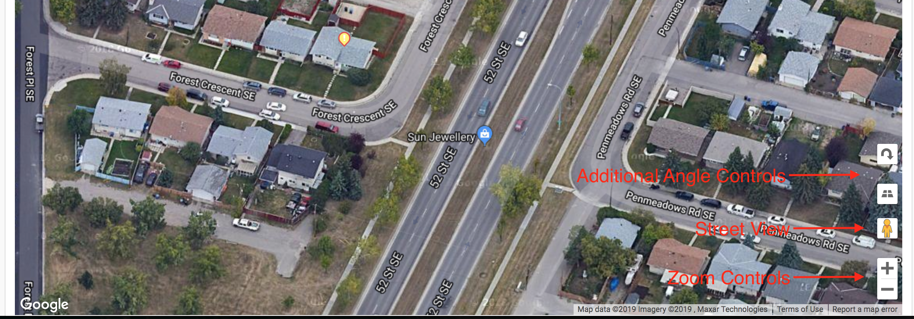

# Viewing Work

In order to complete work expand the area of interest and click on the List operation. 

Job list offers various styles of display which can make managing and viewing the lists easier. In order to change the view click on *Display* and select from one of the available options. *Note that all view are designed to be compatible on all supported devices accross desktop, tablet or mobile*. Each view offers ability to quick preview customer, get directions to customer and see job details.

Each view can be toggled by additional date and filter attributes.

- [List View](#list-view)
- [Calendar View](#calendar-view)
- [Map View](#map-view)

## List View

This view allows for comprehensive listing and browsing. Use this screen to view and manage completions, reschedule jobs and edit additional information.

## Calendar View

The view allows for time period representation of work assigned.

## Map View

The view allows for spacial representation of work.

The location pins on the map represent the work crews are currently working on. Inside the pin are several key factors:

1) Fill - indicates the crew assigned (crew color can be changed in Settings)
2) Outline - color of the outline represents status of work, whether it has been completed, canceled or pending
3) Icon - inside each pin is an icon which further help identify the status

Pins can be clicked to bring up the detailed view of the customer.

Map can be toggled between Street and Hybrid view, which is a combination of Satelite and Street. They offer different benefits and representation of neighborhoods that the jobs occur in.

For example, at close enough zoom on the property, maps will display a 3D rendering of the location. Use the controls provide by the maps to look around the property or use street view for a closer look. 